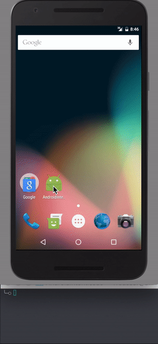

# android-intent-issue

This repo illustrates an issue with out-of-the-box deep linking in React Native for Android. Each deep link creates a new activity. The [Android `<activity>` docs](http://developer.android.com/guide/topics/manifest/activity-element.html) indicate that default "`standard`" behavior is:

> The system always creates a new instance of the activity in the target task and routes the intent to it.

The solution is to add `launchMode` to the main activity definition:

```xml
    <activity
      android:name=".MainActivity"
      android:launchMode="singleTask"
    ...
```

According to the docs for `singleTask` mode,

> The system creates the activity at the root of a new task and routes the intent to it. However, if an instance of the activity already exists, the system routes the intent to existing instance through a call to its onNewIntent() method, rather than creating a new one.

This approach fixes the issue but requires additional hookup to route the [`onNewIntent`](http://developer.android.com/reference/android/app/Activity.html#onNewIntent(android.content.Intent)) event through `RCTDeviceEventEmitter` in a manner that completes the missing implementation of [`Linking.addEventListener`](http://facebook.github.io/react-native/docs/linking.html#addeventlistener) for React Native.



